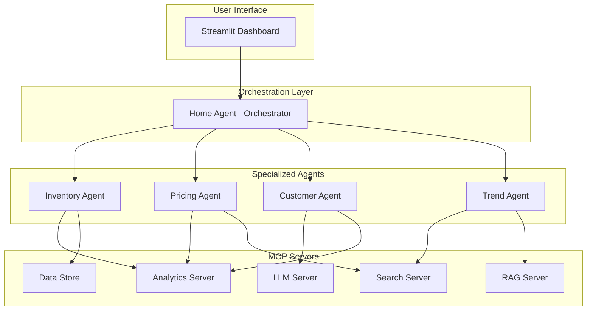

# Meridian Retail Group - AI Multi-Agent System


## 🏬 Overview

The Meridian Retail Group AI Demo is a sophisticated multi-agent orchestration platform designed to revolutionize retail operations through intelligent automation. This demo showcases how AI agents can collaborate to handle complex retail scenarios including inventory management, dynamic pricing, customer service, and trend analysis.

### 🎯 Key Features

- **Multi-Agent Orchestration**: Intelligent coordination between specialized AI agents
- **Real-time Analytics**: Live insights into inventory, pricing, and customer behavior
- **MCP Integration**: Model Context Protocol for enhanced AI capabilities
- **South African Market Focus**: Localized for SA retail conditions and compliance
- **Scalable Architecture**: Kubernetes-ready for enterprise deployment

## 🏗️ Architecture

### System Overview



### Agent Capabilities

| Agent | Role | Key Capabilities |
|-------|------|------------------|
| **Home Agent** | Chief Orchestrator | Query analysis, Multi-agent coordination, System monitoring |
| **Inventory Agent** | Supply Chain Expert | Stock management, Demand forecasting, Reorder optimization |
| **Pricing Agent** | Revenue Optimizer | Dynamic pricing, Competitive analysis, Promotion planning |
| **Customer Agent** | Service Specialist | Query resolution, Personalization, Loyalty management |
| **Trend Agent** | Market Analyst | Fashion forecasting, Seasonal analysis, Competitor tracking |

## 🚀 Quick Start

### Prerequisites

- Python 3.11 or higher
- Podman and Podman Compose
- Git
- 8GB RAM minimum (16GB recommended)
- OpenAI API key (for LLM capabilities)

### Installation

1. **Clone the repository**
   ```bash
   git clone https://github.com/meridian-retail/ai-demo.git
   cd ai-demo
   ```

2. **Set up environment**
   ```bash
   # Create virtual environment
   python -m venv venv
   
   # Activate virtual environment
   # On Windows:
   venv\Scripts\activate
   # On macOS/Linux:
   source venv/bin/activate
   
   # Install dependencies
   pip install -e .
   ```

3. **Configure environment variables**
   ```bash
   cp .env.example .env
   # Edit .env with your configuration
   ```

4. **Initialize the system**
   ```bash
   # Run setup script
   ./scripts/setup.sh
   
   # Start MCP servers
   podman-compose up -d
   
   # Initialize data
   python scripts/init_data.py
   ```

5. **Launch the application**
   ```bash
   streamlit run streamlit_app/app.py
   ```

   Navigate to `http://localhost:8501` in your browser.

## 📖 Usage Guide

### Basic Operations

#### 1. Simple Inventory Check
```python
# Query: "What's the stock level for blazer MF-BLZ-001 in Cape Town?"
# Agents involved: Inventory Agent
# Response includes: Current stock, reorder status, availability
```

#### 2. Price Optimization
```python
# Query: "Optimize pricing for summer collection with 20% margin target"
# Agents involved: Pricing Agent, Inventory Agent, Trend Agent
# Response includes: Recommended prices, expected impact, implementation plan
```

#### 3. Customer Service
```python
# Query: "Customer complaint about late delivery, order #12345"
# Agents involved: Customer Agent
# Response includes: Resolution steps, compensation, follow-up plan
```

#### 4. Complex Business Analysis
```python
# Query: "Analyze Q4 performance and recommend strategies for Q1"
# Agents involved: All agents coordinated by Home Agent
# Response includes: Comprehensive analysis, cross-functional insights, action items
```

### Advanced Features

#### Multi-Agent Orchestration
The Home Agent automatically determines query complexity and orchestrates responses:

- **Simple Queries**: Direct routing to single agent
- **Moderate Queries**: Parallel processing with 2-3 agents
- **Complex Queries**: Hierarchical processing with lead agent
- **Advanced Queries**: Adaptive strategy with dynamic agent engagement

#### Real-time Monitoring
Access the monitoring dashboard to view:
- Agent performance metrics
- System health status
- Query processing times
- Success rates and error tracking

## 🛠️ Development

### Project Structure
```
meridian-retail-ai/
├── agents/                    # Agent implementations
│   ├── base_agent.py         # Base agent framework
│   ├── home_agent.py         # Orchestrator agent
│   ├── inventory_agent.py    # Inventory management
│   ├── pricing_agent.py      # Pricing optimization
│   ├── customer_agents.py    # Customer service
│   └── trend_agent.py        # Trend analysis
├── mcp_servers/              # MCP server implementations
│   ├── analytics_server.py   # Analytics MCP server
│   ├── search_server.py      # Search MCP server
│   ├── rag_server.py         # RAG MCP server
│   └── llm_server.py         # LLM MCP server
├── streamlit_app/            # Web interface
│   ├── app.py               # Main application
│   └── pages/               # Dashboard pages
├── data/                     # Data files
│   ├── products.json        # Product catalog
│   ├── customers.json       # Customer data
│   └── market_data.json     # Market information
├── docs/                     # Documentation
├── tests/                    # Test suite
└── scripts/                  # Utility scripts
```

### Adding New Agents

1. Create new agent class inheriting from `BaseAgent`
2. Define agent capabilities in `__init__`
3. Implement `process_query` method
4. Add agent to `crew_config.yaml`
5. Register in Home Agent's registry

Example:
```python
class NewAgent(BaseAgent):
    def __init__(self, mcp_servers, data_store):
        capabilities = [
            AgentCapability(
                name="new_capability",
                description="Description of capability",
                input_schema={...},
                output_schema={...}
            )
        ]
        super().__init__(
            name="NewAgent",
            role="Role Description",
            goal="Agent Goal",
            backstory="Agent Backstory",
            capabilities=capabilities
        )
```

### Testing

Run the test suite:
```bash
# Run all tests
pytest

# Run specific test category
pytest tests/agents/
pytest tests/integration/

# Run with coverage
pytest --cov=agents --cov-report=html
```

## 🌍 Deployment

### Local Deployment
```bash
./scripts/deploy-local.sh
```

### Kubernetes/OpenShift Deployment
```bash
# Configure your cluster
kubectl config use-context your-cluster

# Deploy
./scripts/deploy-openshift.sh

# Verify deployment
kubectl get pods -n meridian-ai
```

### Environment Configuration

#### Development
- Single instance of each component
- Local data storage
- Debug logging enabled

#### Production
- Auto-scaling enabled (1-10 instances)
- Persistent volume storage
- Monitoring and alerting active
- SSL/TLS encryption
- RBAC enabled

## 📊 Demo Scenarios

### Scenario 1: Seasonal Planning
**Query**: "Prepare for summer season - analyze trends, optimize inventory, and plan pricing strategy"

**Demonstrates**:
- Multi-agent collaboration
- Predictive analytics
- Strategic planning

### Scenario 2: Customer Retention
**Query**: "Identify at-risk platinum customers and create retention campaign"

**Demonstrates**:
- Customer analytics
- Personalization
- Loyalty management

### Scenario 3: Real-time Operations
**Query**: "Current system status with optimization recommendations"

**Demonstrates**:
- System monitoring
- Performance optimization
- Operational insights

## 🔧 Configuration

### Agent Configuration (crew_config.yaml)
```yaml
agents:
  inventory_agent:
    name: "InventoryAgent"
    role: "Inventory Management Specialist"
    capabilities:
      - stock_management
      - demand_forecasting
    mcp_servers:
      - analytics_server
      - data_warehouse
```

### MCP Server Configuration
```yaml
mcp_servers:
  analytics_server:
    endpoint: "http://localhost:8001"
    capabilities:
      - data_analysis
      - metrics_calculation
```

### Performance Tuning
```yaml
performance:
  max_parallel_tasks: 5
  task_timeout: 300
  retry_failed_tasks: true
  max_retries: 3
```

## 📈 Monitoring and Analytics

### Key Metrics
- **Response Time**: Average query processing time
- **Success Rate**: Percentage of successful query resolutions
- **Agent Utilization**: Workload distribution across agents
- **System Health**: Overall system performance score

### Accessing Metrics
1. Dashboard: `http://localhost:8501/analytics`
2. API: `GET /api/metrics`
3. Logs: `/var/log/meridian_ai/`

## 🔒 Security

### Authentication
- JWT-based authentication
- Role-based access control (RBAC)
- API key management

### Data Privacy
- PII masking enabled
- Audit logging
- POPIA compliance (South African privacy law)
- 90-day data retention

### Compliance
- POPIA (Protection of Personal Information Act)
- PCI-DSS for payment data
- ISO 27001 for information security

## 🐛 Troubleshooting

### Common Issues

1. **Agent Not Responding**
   ```bash
   # Check agent status
   curl http://localhost:8501/api/agents/status
   
   # Restart specific agent
   docker-compose restart inventory_agent
   ```

2. **MCP Connection Failed**
   ```bash
   # Verify MCP servers are running
   docker-compose ps
   
   # Check MCP logs
   docker-compose logs mcp_analytics
   ```

3. **High Response Times**
   - Check system resources
   - Review agent workload distribution
   - Enable performance profiling

### Debug Mode
```python
# Enable debug logging
export MERIDIAN_DEBUG=true
export LOG_LEVEL=DEBUG
```

## 🤝 Contributing

We welcome contributions! Please see our [Contributing Guide](docs/CONTRIBUTING.md) for details.

### Development Workflow
1. Fork the repository
2. Create feature branch (`git checkout -b feature/AmazingFeature`)
3. Commit changes (`git commit -m 'Add AmazingFeature'`)
4. Push to branch (`git push origin feature/AmazingFeature`)
5. Open Pull Request

## 📝 License

This project is licensed under the MIT License - see the [LICENSE](LICENSE) file for details.

## 🙏 Acknowledgments

- CrewAI team for the multi-agent framework
- Anthropic for MCP (Model Context Protocol)
- Streamlit for the web framework
- The open-source community

## 📞 Support

- **Documentation**: [Full Docs](docs/)
- **Issues**: [GitHub Issues](https://github.com/meridian-retail/ai-demo/issues)
- **Email**: danie.thom@gmail.com 


## 🚦 Status

- **Current Version**: 1.0.0-demo
- **Status**: Demo/Prototype
- **Production Ready**: Q2 2025 (estimated)

---

<div align="center">
  <b>Bold Mountain</b><br>
  Empowering Retail with Intelligent AI<br>
  🇿🇦 Proudly South African
</div>