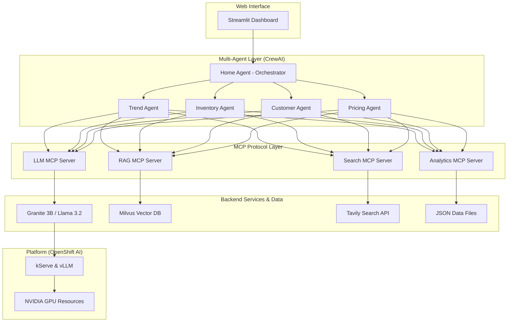

# Meridian Retail Group - AI Multi-Agent System # 
## 🎯 Overview ##
This project is a comprehensive demonstration of a unified AI platform built for the fictional Meridian Retail Group. It showcases advanced AI-powered retail operations by combining:

**- Multi-Agent Collaboration using CrewAI for specialized retail tasks.**

**- MCP (Model Context Protocol) for standardized and decoupled AI tool integration.**

**- RAG (Retrieval-Augmented Generation) with a Milvus vector database for deep knowledge retrieval.**

**- Real-time Search Integration via the Tavily API.**

**- Enterprise-Grade LLM Hosting on OpenShift AI with kServe and vLLM.**

## 🏢 Demo Company: Meridian Retail Group ##
Meridian Retail Group is a fictional South African retail conglomerate with four distinct brands:

- **Meridian Fashion:** Contemporary fashion for professionals.

- **Stratus:** Youth-oriented streetwear and trends.

- **Casa Living:** Premium homeware and decor.

- **Vertex Sports:** Athletic and outdoor gear.

## 🚀 Quick Start ##
**Prerequisites**
- Python 3.11+ (or 3.13.5 with pyenv)

- uv package manager (recommended) or pip

- Podman and Podman Compose (for local MCP server testing)

- OpenShift 4.18+ with GPU support (for full deployment)

- Tavily API key

**Local Development Setup**
Clone the Repository
```bash
git clone [https://github.com/YOUR_USERNAME/openshift-ai-unified-demo.git](https://github.com/YOUR_USERNAME/openshift-ai-unified-demo.git)
cd openshift-ai-unified-demo

Set Up Environment

# Create and activate a virtual environment
python -m venv .venv
source .venv/bin/activate

Install Dependencies

# Using uv (recommended)
uv pip install -e ".[dev]"

# Or using pip
pip install -e ".[dev]"

Configure Environment Variables

cp .env.example .env
# Edit the .env file with your TAVILY_API_KEY and other settings

Run the Application

# This will launch the Streamlit UI
streamlit run streamlit_app/app.py
```

## 🏗️ Architecture ##


## 📁 Repository Structure ##
```
meridian-retail-ai/
├── README.md
├── pyproject.toml
├── .env.example
│
├── agents/                 # Agent implementations (home, inventory, etc.)
├── data/                   # Synthetic JSON data (products, customers, etc.)
├── docs/                   # Documentation (architecture, guides)
│
├── k8s/                    # Kubernetes manifests (Kustomize)
│   ├── base/               # Base configs (namespace, deployments, services)
│   └── overlays/
│       ├── local/          # Patches for OpenShift Local (CRC)
│       └── production/     # Patches for full OpenShift AI cluster
│
├── mcp_servers/            # FastAPI MCP servers (llm, rag, search, analytics)
├── scripts/                # Automation scripts (deploy, setup, etc.)
├── streamlit_app/          # Streamlit web interface code
└── tests/                  # Pytest suites (unit, integration)
```

## 🎯 Demo Scenarios ##
**1. Fashion Trend Analysis (Multi-Agent + RAG)**

- **Query:** "What winter fashion trends should our Cape Town stores focus on for professional women?"
- **Agents:** Trend, Customer, Inventory, Pricing
- **Result:** A comprehensive report with actionable inventory and pricing recommendations.

**2. Cross-Sell Opportunity (MCP Integration)**
- *Query:** "Customer Sarah Johnson just bought a winter coat. What should we recommend next?"
- **Tools:** RAG (purchase history), Search (matching accessories), Analytics (personalization).
- **Result:** Personalized product recommendations with a high probability of conversion.

**3. Dynamic Inventory Optimization (Agent Orchestration)**
- **Query:** "Optimize inventory for the upcoming summer season across all Johannesburg stores."
- **Process:** Trend forecasting, historical sales analysis, and dynamic price optimization.
- **Result:** A detailed inventory plan with quantities, timing, and pricing strategies.

**4. Customer Complaint Resolution (Advanced Orchestration)**
- **Query:** "A high-value customer is complaining about a delayed delivery."
- **Strategy:** The Home Agent coordinates the Customer, Inventory, and Pricing agents to analyze the issue, find a solution, and calculate appropriate compensation to retain the customer.
- **Result:** An immediate resolution with a retention strategy.

## 🌍 Deployment
Local Development (CRC)
For testing on a constrained hardware environment like a laptop running OpenShift Local.

### Deploys with resource-friendly settings
```bash
./scripts/deploy-local.sh
```

Production OpenShift
For the full demo on an OpenShift AI cluster with GPU resources.

#### Deploys with production-ready settings (replicas, resources, real endpoints)
```bash
./scripts/deploy-openshift.sh
```

🔧 Configuration
Key configuration is managed through environment variables, loaded from the .env file for local development and from ConfigMaps/Secrets in OpenShift.

## API Keys
```bash
TAVILY_API_KEY=your_key_here
```

## OpenShift Settings
```bash
OPENSHIFT_NAMESPACE=retail-ai-demo
GRANITE_ENDPOINT=http://granite-service:8080 # Patched by Kustomize
```

## MCP Server Ports
```bash
LLM_MCP_PORT=8001
RAG_MCP_PORT=8002
SEARCH_MCP_PORT=8003
ANALYTICS_MCP_PORT=8004
```

## RAG Settings
```bash
MILVUS_HOST=milvus-service
MILVUS_PORT=19530
```

# 🧪 Testing
The project includes a comprehensive test suite using Pytest.

## Run all tests
``` bash
make test
```
## Run only unit tests
```bash
pytest tests/unit
```
## Run only integration tests
```bash
pytest tests/integration
```
# 🤝 Contributing
We welcome contributions! Please see our CONTRIBUTING.md for details on our development workflow and code standards.

# 📄 License
This project is licensed under the MIT License. See the LICENSE file for details.