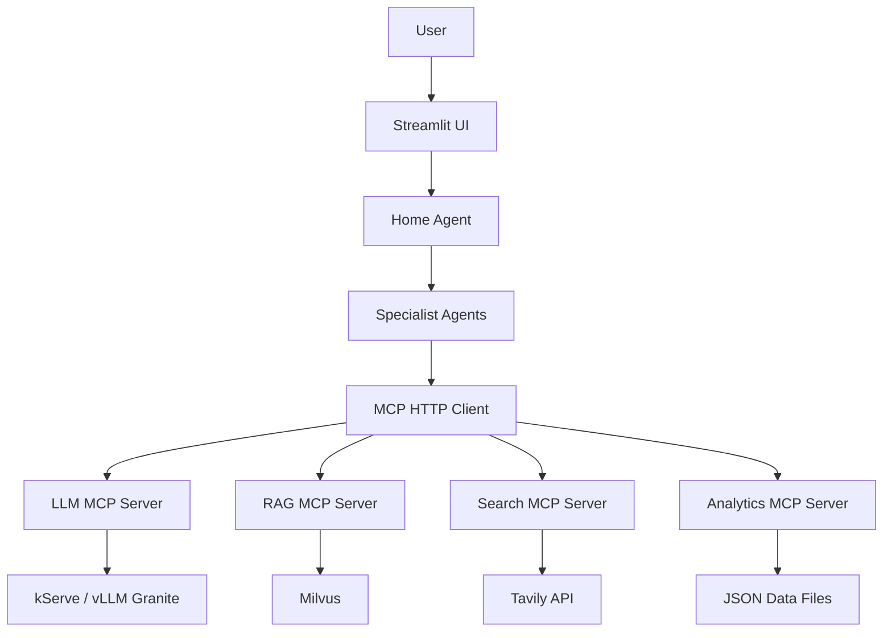

# Meridian Retail Group — AI Multi-Agent System

A demonstration of unified AI for retail operations on **Red Hat OpenShift AI**. The fictional **Meridian Retail Group** uses a crew of specialized agents, MCP microservices, RAG with Milvus, live web search, and Granite served via kServe/vLLM.

## Overview

This project combines:

- **Multi-agent collaboration** (CrewAI) — Home, Trend, Inventory, Pricing, and Customer agents
- **MCP protocol layer** (FastAPI) — standardized HTTP `/invoke` endpoints for tools
- **RAG** — Milvus vector search over project JSON knowledge (`rag/service.py`)
- **Real-time search** — Tavily API via the Search MCP server
- **Enterprise LLM hosting** — kServe + vLLM (Granite) on OpenShift AI with GPU

## Demo company

Meridian Retail Group is a fictional South African retail conglomerate:

| Brand | Focus |
|-------|--------|
| Meridian Fashion | Contemporary professional fashion |
| Stratus | Youth streetwear and trends |
| Casa Living | Premium homeware |
| Vertex Sports | Athletic and outdoor gear |

## Quick start (local development)

### Prerequisites

- Python 3.11+
- [uv](https://github.com/astral-sh/uv) or pip
- Tavily API key ([tavily.com](https://tavily.com))
- Optional: Podman Desktop + `podman compose` for local PostgreSQL (see [DEPLOYMENT.md — Local development with Podman](docs/DEPLOYMENT.md#local-development-with-podman))
- Optional: [Ollama](https://ollama.com) for local LLM (Granite 3.2 — see [DEPLOYMENT.md — Local LLM with Ollama](docs/DEPLOYMENT.md#local-llm-with-ollama))
- Optional: Milvus for real RAG (Podman/Docker standalone — see deployment guide)
- Optional: OpenShift CLI (`oc`) for cluster deployment

### Setup

```bash
git clone https://github.com/daniethom/openshift-ai-unified-demo.git
cd openshift-ai-unified-demo

make install
cp .env.example .env
# Edit .env — set TAVILY_API_KEY; configure Ollama LLM vars for local dev
ollama pull granite3.2:8b   # optional local LLM
```

### Run MCP servers

```bash
make run-mcp-servers
# or start individually:
# uvicorn mcp_servers.llm_server:app --port 8001
# uvicorn mcp_servers.rag_server:app --port 8002
# uvicorn mcp_servers.search_server:app --port 8003
# uvicorn mcp_servers.analytics_server:app --port 8004
```

### Run the UI

```bash
make run-ui
# or: .venv/bin/streamlit run streamlit_app/app.py
```

Set `RAG_USE_FALLBACK=true` in `.env` if Milvus is not running locally.

For local LLM, set `LLM_API_BASE=http://127.0.0.1:11434/v1`, `LLM_MODEL_NAME=granite3.2:8b`, and `LLM_API_KEY=ollama` (see [DEPLOYMENT.md](docs/DEPLOYMENT.md#local-llm-with-ollama)).

## Architecture


```mermaid
graph TB
    User --> Streamlit[Streamlit UI]
    Streamlit --> HomeAgent[Home Agent]
    HomeAgent --> Agents[Specialist Agents]
    Agents --> MCPClient[MCP HTTP Client]
    MCPClient --> LLM_MCP[LLM MCP Server]
    MCPClient --> RAG_MCP[RAG MCP Server]
    MCPClient --> SEARCH_MCP[Search MCP Server]
    MCPClient --> ANALYTICS_MCP[Analytics MCP Server]
    LLM_MCP --> KServe[kServe / vLLM Granite]
    RAG_MCP --> Milvus[Milvus]
    SEARCH_MCP --> Tavily[Tavily API]
    ANALYTICS_MCP --> JSON[JSON Data Files]
```

Configuration is centralized in `config/settings.py`. Agents call MCP servers through `agents/mcp_client.py` using URLs from environment variables (never hardcoded `localhost` in cluster code).

See [docs/ARCHITECTURE.md](docs/ARCHITECTURE.md) for details.

## Repository structure

```
├── agents/              # CrewAI agents + mcp_client.py
├── config/              # Central settings (config/settings.py)
├── data/                # Synthetic JSON (products, trends, customers)
├── docs/                # Architecture, deployment, demo guides
├── k8s/
│   ├── base/            # Namespace, ConfigMaps, Deployments, Milvus, Routes
│   └── overlays/
│       ├── local/       # CRC / resource-constrained clusters
│       └── production/  # kServe, BuildConfig, model PVC, Granite route
├── mcp_servers/         # FastAPI MCP microservices
├── rag/                 # Milvus RAG service (rag/service.py)
├── scripts/             # Deploy, build, validate, demo checklist
├── streamlit_app/       # Web UI
└── tests/               # Pytest (unit + integration)
```

## Deployment on OpenShift

Full instructions: **[docs/DEPLOYMENT.md](docs/DEPLOYMENT.md)**

### One-command production deploy

```bash
# Create secrets first (see docs/DEPLOYMENT.md)
make deploy-prod-full
```

This builds the image, applies manifests, primes Milvus, downloads the Granite model, and validates the deployment.

### Common commands

| Command | Description |
|---------|-------------|
| `make deploy-local-full` | Build + deploy + validate on CRC/local OpenShift |
| `make deploy-prod-full` | Full production pipeline |
| `make build-images` | Build and push image to internal registry |
| `make download-model-cluster` | Download Granite weights to cluster PVC |
| `make validate` | Pre-demo health checks |
| `make demo-checklist` | Routes, pod status, sample queries |
| `make demo-checklist-strict` | Checklist + validation (exit 1 if not ready) |

### Demo day

Before presenting:

```bash
make demo-checklist-strict
```

Presenter script and scenarios: [docs/DEMO_GUIDE.md](docs/DEMO_GUIDE.md)

**Note:** The Streamlit **Dashboard** uses mock/illustrative analytics for presentation; **live data** is shown on the main chat, **Configuration** tab (read-only env), **Analytics** page, and **MCP Tools** page. See [DEMO_GUIDE.md §3](docs/DEMO_GUIDE.md#3-streamlit-ui-mock-vs-live-data).

## Configuration

All settings load from environment variables via `config/settings.py`. Copy `.env.example` to `.env` for local use; on OpenShift use ConfigMaps and Secrets (see `k8s/base/configmap.yaml` and `k8s/base/secret.yaml`).

### Key variables

| Variable | Purpose |
|----------|---------|
| `LLM_MCP_URL`, `RAG_MCP_URL`, … | Full HTTP URLs to MCP services |
| `LLM_API_BASE` | OpenAI-compatible endpoint — Ollama locally (`http://127.0.0.1:11434/v1`) or kServe on cluster |
| `LLM_MODEL_NAME` | Model name — e.g. `granite3.2:8b` (Ollama) or `granite-3b` (kServe) |
| `LLM_API_KEY` | API key — `ollama` for local Ollama; cluster token or `not-needed` for kServe |
| `TAVILY_API_KEY` | Tavily search (Secret on cluster) |
| `MILVUS_URI` | Milvus connection string |
| `MILVUS_COLLECTION_NAME` | Vector collection (default: `meridian_knowledge`) |
| `RAG_USE_FALLBACK` | Use static docs when Milvus unavailable |
| `MODEL_HF_REPO` | Hugging Face repo for Granite download |
| `OPENSHIFT_NAMESPACE` | Target namespace (default: `retail-ai-demo`) |

Legacy `GRANITE_ENDPOINT` is still supported as an alias for `LLM_API_BASE`.

## Demo scenarios

1. **Fashion trends** — *"What winter fashion trends should our Cape Town stores focus on for professional women?"*
2. **Cross-sell** — *"Customer Sarah Johnson bought a winter coat. What should we recommend?"*
3. **Inventory** — *"Optimize inventory for the upcoming summer season across all Johannesburg stores."*
4. **Complaint resolution** — *"A high-value customer is complaining about a delayed delivery and poor service."*

## Testing

```bash
make test              # Full suite (RAG_USE_FALLBACK=true)
make lint              # Ruff + Black
pytest tests/unit      # Unit tests only
pytest tests/integration
```

CI runs on push/PR via GitHub Actions (`.github/workflows/ci.yml`): lint, test, and Docker build.

## Documentation

| Document | Description |
|----------|-------------|
| [CHANGELOG.md](CHANGELOG.md) | Version history and refactor release notes |
| [docs/DEPLOYMENT.md](docs/DEPLOYMENT.md) | OpenShift deploy, secrets, kServe, Milvus, CI/CD |
| [docs/ARCHITECTURE.md](docs/ARCHITECTURE.md) | System design and data flow |
| [docs/MCP_INTEGRATION.md](docs/MCP_INTEGRATION.md) | MCP API contracts and server tools |
| [docs/MULTI_AGENT_DESIGN.md](docs/MULTI_AGENT_DESIGN.md) | Agent orchestration patterns |
| [docs/DEMO_GUIDE.md](docs/DEMO_GUIDE.md) | Live demo script and checklist |

## Contributing

See [CONTRIBUTING.md](CONTRIBUTING.md).

## License

MIT — see [LICENSE.md](LICENSE.md).
