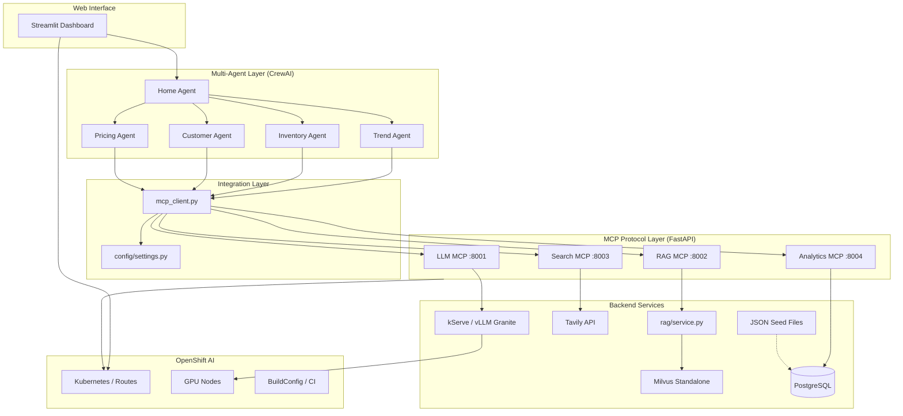

# System Architecture

## 1. Introduction

The Meridian Retail AI demo is a multi-agent platform for retail operations on Red Hat OpenShift AI. Specialized CrewAI agents collaborate through a standardized MCP (Model Context Protocol) layer. Backend services include PostgreSQL (system of record), Milvus RAG, Tavily search, and Granite served via kServe/vLLM. JSON files under `data/` are seed input only.

## 2. Architecture diagram

## 3. Component breakdown

### 3.1 Streamlit UI

- **Path:** `streamlit_app/app.py`
- **Role:** Chat-based demo interface; initializes agents in-process and reads MCP URLs from `config/settings.py`
- **Deployment:** `k8s/base/streamlit-ui-deployment.yaml` with OpenShift Route

### 3.2 Multi-agent layer

- **Path:** `agents/`
- **Technology:** CrewAI
- **HomeAgent:** Query analysis, routing, synthesis
- **Specialists:** Trend, Inventory, Pricing, Customer agents

Agents do not embed tool-specific SDK logic. They call **`agents/mcp_client.py`**, which performs HTTP `POST /invoke` requests to MCP servers.

### 3.3 Configuration layer

- **Path:** `config/settings.py`
- **Role:** Single source of truth for environment variables
- **Local:** `.env` file (from `.env.example`)
- **OpenShift:** `k8s/base/configmap.yaml` + Secrets, patched by Kustomize overlays

### 3.4 MCP protocol layer

Four FastAPI microservices in `mcp_servers/`:

| Server | Port | Backend |
|--------|------|---------|
| `llm_server.py` | 8001 | OpenAI-compatible kServe endpoint |
| `rag_server.py` | 8002 | Milvus via `rag/service.py` |
| `search_server.py` | 8003 | Tavily API |
| `analytics_server.py` | 8004 | PostgreSQL via `db/service.py` (JSON fallback) |

Each exposes `POST /invoke` (LLM also uses `{"prompt": "..."}`) and `GET /healthz`.

### 3.5 RAG subsystem

- **`rag/service.py`** — indexing and retrieval; builds documents from PostgreSQL or JSON seed files
- **`scripts/prime_database.py`** — populates Milvus collection `meridian_knowledge`
- **Fallback** — static documents when `RAG_USE_FALLBACK=true` or Milvus is unavailable

### 3.6 Backend services

- **Milvus** — deployed as standalone in `k8s/base/milvus-*.yaml`
- **Tavily** — external search API; key in Secret
- **PostgreSQL** — relational system of record (`db/` package, Alembic migrations, seed Job)
- **JSON seed files** — offline fallback and initial load via `db/seed.py`
- **Granite LLM** — kServe InferenceService in production overlay

### 3.7 OpenShift AI platform

- **Kustomize** — `k8s/base/` + overlays (`local`, `production`)
- **Routes** — Streamlit UI; optional Granite API route
- **Jobs** — database migrate/seed, Milvus priming, Granite model download
- **BuildConfig** — on-cluster image builds
- **CI** — GitHub Actions lint, test, Docker build

## 4. Data flow

1. User submits a query in Streamlit.
2. **HomeAgent** classifies intent and selects specialist agents.
3. Specialists call **`mcp_client`** functions (`web_search`, `retrieve_documents`, etc.).
4. MCP servers execute backend logic and return JSON.
5. Agents process results; HomeAgent synthesizes a response.
6. Streamlit displays the final answer.

Example: a trend query triggers the Trend Agent → Search MCP (Tavily) + RAG MCP (Milvus) → HomeAgent synthesis.

## 5. Deployment topology

**Local overlay:** all MCP deployments, Milvus, Streamlit; no InferenceService.

**Production overlay:** adds kServe Granite, model PVC, BuildConfig, Granite Route; ConfigMap points `LLM_API_BASE` at in-cluster kServe.

Operational scripts: see [DEPLOYMENT.md](DEPLOYMENT.md).

## 6. Related documentation

- [MCP_INTEGRATION.md](MCP_INTEGRATION.md) — API contracts
- [MULTI_AGENT_DESIGN.md](MULTI_AGENT_DESIGN.md) — orchestration patterns
- [DEPLOYMENT.md](DEPLOYMENT.md) — deploy and validate
- [DEMO_GUIDE.md](DEMO_GUIDE.md) — live demo script
